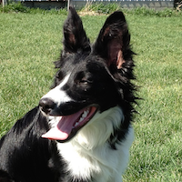

# AgilityA03

### Platform
- *Android: API 21 and up*
- *supported devices: Android phones and tablets*

### Version
- *1.0 - will be released in September 2020*

## Description
**AgilityA03** is an application written for dog agility enthusiasts who compete in trials
  sanctioned by Agility Association of Canada.
  Results of AAC trials are kept in AAC database and are available on the *aactrialresults* web page.
  The dog achievements, such as **Qs** and **titles** are recorded and referred to by AAC as *Dog Achievement Page*.

  The application downloads your *Dog Achievement Page*, presents it on an iPhone and
  allows you to sort your dogs data by a *trial year*, *leg name*, *trial judge* and
  *trial host*.

  The data are downloaded via WIFI or via cellular phone network.
  The application remembers the last accessed data and if there is no connection available,
  it will offer to read last accessed data offline.

## Availability
- *application is free, full functionality, no in-app purchases*
- *no adds*
- *available in Canada only*
- *available on Google Play Store - (to see screenshots, access the Play Store)*
- *(Google Play is a trademark of Google LLC)*

## Support
*Support via email to: <hybswsupp@gmail.com>*

## App Details
#### The application has the following parts:

1. **Dog records** i.e. a screen presenting a List of dogs
2. **AAC records** i.e. a screen presenting Dog Achievement Page
3. **Help Page** i.e. a scren presenting brief help information
4. **Privacy Policy Page** i.e. application Privacy Policy

**Dog records** - the app has the following functions:

1. **Create a dog record**
	- to create a dog record, use the red **'+'** button down in the right corner of the screen
	- the app will present **Add Dog Record** screen for you to fill in the record parts
	- the record has the following parts:
		- dog name (just for your needs)
		- dog AAC number (used to access AAC database data for your dog)
		- dog picture (just for your needs)
	- note: the application needs to have an access to your photo library to get the dog's picture
	- after filling all 3 parts, tap the **Save** button in the right upper corner of the screen
2. **Delete a dog record**
	- to delete a dog record, use **long touch** on the dog record
	- the application will display alert message showing the option to **Delete** the record
	- confirm the deletion by tapping the  **Delete** button
3. **Edit a dog record**
	- to edit a dog record, use **long touch** on the dog record
	- the application will display alert message showing the option to **Edit** the record
	- confirm the editing by tapping the  **Edit** button

The Dog Records are kept in a file in the application directory.
The directory can be accessed only by the application.

**AAC Records**

The application retrieves the Dog Achievements Page from the *aactrialresults* site,
transform the HTML data into AAC records and displays the records on a screen.
For AAC Records, the app has the following functions:

1. Sorting the records by date, ascending
2. Sorting the records by date, descending
3. Display selected records - by the year
4. Display selected records - by the judge
5. Display selected records - by the hosting organization
6. Display selected records - by the name of the leg (e.g. Starters Jumpers, etc)
7. Display summary of all master legs

To apply the above functions:

- tap the *Menu* button in the upper right corner of the screen
- the application displays the list of functions
- tap the function
- the application displays a list of available choices
- select the appropriate choice

The application keeps the last displayed Dog Achievement Page in a file in
the application directory.
If the application cannot connect to the *aactrialresults* site, it will use
this last saved file for the offline processing.

## Privacy Policy

### Application **AgilityA03**
 Effective Date: February 1, 2020.

### Basics
This privacy policy governs your use of the software application **AgilityA03**  (the "Application")
for mobile devices that was created by HYBSW team.
The Application is written for dog agility enthusiasts who compete in trials
sanctioned by Agility Association of Canada.
Results of AAC trials are kept in AAC database and are available as a *Dog Achievement Page*.
The Application downloads your *Dog Achievement Page*, presents it on a mobile device and
allows you to sort your dogs data by a *trial year*, *leg name*, *trial judge* and *trial host*.

### Collected Data
The Application is asking its users to provide the following data:

1. Dog name
2. Dog AAC number
3. Dog picture

All above data is used to present the user a list of her/his dogs.
The **dog AAC number** is used to access the dog AAC records on the AAC website.
Application collected data are stored in a file on the device and can be accessed
only by this application on this device.
The data is never shared with any other application.

The Application **does not collect any personable data**.
(The Application does not need and does not use *user names, user emails, user addresses*).

### Deleting Collected Data
Collected data can be deleted by deleting the Application from your device or by deleting all records
from the device file system (using the Application 'delete' function).

### Analytics Data
The Application does not collect any analytics information.
The Application does not need and does not collect *geolocation information* about your mobile device.

### Security
The Application collected data (dog name, dog picture and dog AAC number) are stored in the
application file,in the application document directory.
The file is accessible only by this application and is never shared with any other applications.

### Your Consent
By using the Applications, you are consenting to our processing of your information as set
forth in this Privacy Policy now and as amended by us. "Processing" means to retrieve
your dogs data from the AAC database and to display and sort your dogs
data by the Application.

### Changes
This Privacy Policy may be updated from time to time for any reason. We will notify you of any
 changes to our Privacy Policy by posting the new Privacy Policy here and will indicate at the
 top of the page the Privacy Policy effective date.

### Contact
If you have any questions regarding privacy while using the Application, or have questions
about our practices, please contact us via email at <hybswsupp@gmail.com>