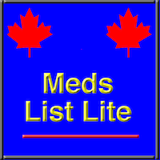

# MedsListLite

### Platform
- *iOS: 9.3 and up*
- *supported devices: iPhone, iPad (in iPhone mode)*

### Version
- *1.6 - Released in December 2017*

## Description

The application helps you to manage a simple list of your current medications, a history list
of your previous medications and a list of your eyeglasses prescriptions.

It will help in case of medical emergency or any situation where you need to provide (remember)
a list of your medications.

The lists can be organized for a single person and/or multiple persons.

The medication lists can be emailed as *pdf* attachments. The eye prescription list can
be emailed as *text* attachment.

The list of medications contains the name of medication, the dosage and the start date.
The list can be organized into groups of your choice. (It can be a group of medications prescribed
 by one doctor,another group of medications prescribed by another doctor etc. Or you can have
 a group of medications for you, for your family members etc).

To move a medication into your history list, edit the medication in the current list
and add the **end date**. The application will ask for a confirmation and it move the
the medication from the current list into the history list.

For the data storage, the application is using iPhone SQLite database.
The database is stored on your iPhone and is not shared with any other application.

## Availability
- *application is free,full functionality, no in-app purchases*
- *no adds*
- *available worldwide*
- *available in Apple store - (to see screenshots, access the Apple store)*
- *Note:*
  - *The application will be removed from the Apple Store in April 2020*

## Support
*Support via email to: <hybswsupp@gmail.com>*

## Privacy Policy

### Application **MedsListLite**

 Effective Date: February 1, 2019

### Basics
This privacy policy governs your use of the software application **MesListLite** for iOS  (the "Application") that was created by HYBSW team.
The application does not collect any personally identifiable information from its users.
All data collected is used to provide the Application functionality.

### Collected Data
Application collected data are stored on the device in the SQLite database and can be accessed only by this application on this device.
The data is never shared with any other application.
Application requires the following: medication name, dosage, start date of the medication, end date of the medication.
Application does not collect personally identifiable data from users.
The Application and the database is confirming to the Apple privacy policy.
Information about Apple privacy policy is available at <https://www.apple.com/privacy/>

### Deleting Collected Data
Collected data can be deleted by deleting the Application from your device or by deleting all records
from the database (using the Application 'delete' function).

### Analytics Data
The application does not collect any analytics information.

### Security
The Application provides reasonable security level for data it processes and maintains, as
required by the above quoted Apple privacy policy.

### Changes
This Privacy Policy may be updated from time to time for any reason. We will notify you of any
 changes to our Privacy Policy by posting the new Privacy Policy here and will indicate at the top of the page the Privacy Policy effective date.

### Contact
If you have any questions regarding privacy while using the Application, or have questions about our practices, please contact us via email at <hybswsupp@gmail.com>